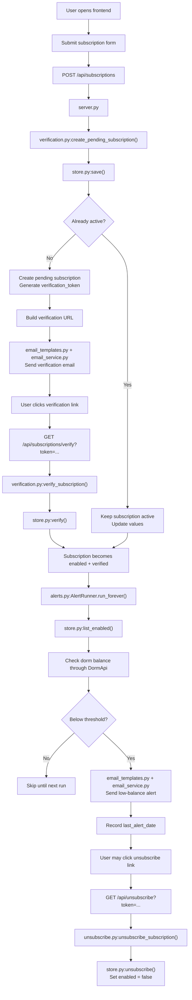

# Subscription Flow

This document records the current subscription, verification, unsubscribe, and alert flow in the `02da` worktree.

## Project Layers

- `server.py`
  - HTTP entry layer
  - Parses requests
  - Calls service modules
  - Returns JSON or plain text

- `subscription_alerts/store.py`
  - Subscription model
  - CSV persistence
  - Verification and unsubscribe state storage

- `subscription_alerts/verification.py`
  - Creates pending subscriptions
  - Builds verification links
  - Sends verification emails
  - Verifies and activates subscriptions

- `subscription_alerts/unsubscribe.py`
  - Handles unsubscribe by token

- `subscription_alerts/alerts.py`
  - Daily alert worker
  - Manual alert check entry
  - Sends low-balance warning emails

- `subscription_alerts/email_templates.py`
  - Verification email content
  - Alert email content

- `subscription_alerts/email_service.py`
  - SMTP sending only

## Startup Flow

Entry point: `server.py -> main()`

On startup:

1. Start `ThreadingHTTPServer`
2. Start the background alert worker with `start_alert_worker(ROOT, ...)`

The process therefore contains:

- an HTTP server
- a background daily alert thread

## HTTP Routes

Handled by `DashboardHandler` in `server.py`.

### GET

- `/api/status`
  - Query current dorm electricity status

- `/api/buildings`
  - Return campus/building list

- `/api/demo-status`
  - Return static demo data

- `/api/subscriptions/verify`
  - Activate a subscription through email verification

- `/api/unsubscribe`
  - Disable a subscription

- `/api/alerts/check`
  - Manually trigger one alert pass

- other paths
  - Serve static frontend files

### POST

- `/api/subscriptions`
  - Create a new low-balance subscription

## Query Status Flow

Route: `/api/status`

Flow:

1. Load config from `.env`
2. Read request parameters:
   - `client`
   - `campusName`
   - `buildingId`
   - `buildingName`
   - `roomName`
   - `days`
3. Call `discover_room_id(...)`
4. Call `DormApi(config).get_status(...)`
5. Return formatted JSON to the frontend

## Subscription Creation Flow

Route: `/api/subscriptions`

Current behavior is "submit first, verify by email, then activate".

Flow:

1. `server.py` reads form data
2. Build `AlertSettings`
3. Create `SubscriptionStore`
4. Call `create_pending_subscription(...)` in `verification.py`

Inside `create_pending_subscription(...)`:

1. Call `store.save(...)`
2. `store.save(...)` builds a `Subscription`
3. Existing rows are matched by:
   - `email`
   - `client`
   - `building_id`
   - `room_name`
4. If an active subscription already exists:
   - keep it active
   - update values
5. Otherwise:
   - create or overwrite a pending subscription
   - generate a new `verification_token`
   - send a verification email

Response:

- `verification_required: true` if email confirmation is needed
- success message telling the user to click the mail link

## Verification Activation Flow

Route: `/api/subscriptions/verify?token=...`

Flow:

1. `server.py` reads `token`
2. Calls `verify_subscription(store, token)`
3. `verify_subscription(...)` delegates to `store.verify(token)`
4. `store.verify(...)`:
   - finds the matching row by `verification_token`
   - sets `enabled = true`
   - sets `verified = true`
   - writes `verified_at`
   - saves back to CSV

Possible results:

- `verified`
- `already_verified`
- `invalid`

## Unsubscribe Flow

Route: `/api/unsubscribe?token=...`

Flow:

1. `server.py` reads `token`
2. Calls `unsubscribe_subscription(store, token)`
3. That delegates to `store.unsubscribe(token)`
4. `store.unsubscribe(...)`:
   - finds the row by `unsubscribe_token`
   - sets `enabled = false`
   - saves back to CSV

Note:

- unsubscribe disables the subscription
- it does not have to clear `verified`

## CSV Storage Model

Stored in `subscription_alerts/store.py`.

Important fields:

- `email`
- `client`
- `campus_name`
- `building_id`
- `building_name`
- `room_name`
- `threshold_kwh`
- `enabled`
- `verified`
- `verification_token`
- `unsubscribe_token`
- `verified_at`
- `last_alert_date`

Actual active status is not a single column.

A subscription is active only when:

- `enabled == true`
- `verified == true`

This is represented by `Subscription.is_active`.

## Alert Worker Flow

Defined in `subscription_alerts/alerts.py`.

### Automatic Loop

`run_forever(...)` waits until `ALERT_CHECK_TIME` and runs one pass every day.

### Manual Check

Route: `/api/alerts/check`

Calls `AlertRunner(ROOT).run_once(...)`.

### One Alert Pass

`run_once(...)` does:

1. `store.list_enabled()` to get active subscriptions
2. Skip subscriptions already alerted today if needed
3. For each remaining subscription call `_check_subscription(...)`

### Per-Subscription Check

`_check_subscription(...)` does:

1. Resolve `room_id`
2. Query `DormApi.get_status(...)`
3. Compare `remaining` with `threshold_kwh`
4. If below threshold:
   - build alert email content
   - send the email
   - record `last_alert_date`

This guarantees:

- unverified subscriptions are skipped
- unsubscribed subscriptions are skipped
- each subscription can be alerted at most once per day

## Email Flow

SMTP sending stays in `subscription_alerts/email_service.py`.

Templates are in `subscription_alerts/email_templates.py`.

This keeps responsibilities separate:

- change wording without touching persistence
- change persistence without touching mail templates

## Current High-Level Flow

Frontend:

1. User submits subscription form
2. Backend stores a pending subscription
3. Backend sends verification email
4. User clicks verification link
5. Backend activates the subscription
6. Daily worker checks active subscriptions
7. If balance is low, backend sends alert email
8. User can disable future alerts through unsubscribe link

## Flow Diagram

