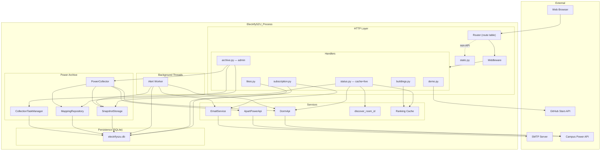

# Architecture Overview

High-level system design, module relationships, and the story behind our dual-layer code organization.

## System Composition

At runtime, ElectrifySZU consists of **one Python process** hosting three concurrent subsystems:

```
┌──────────────────────────────────────────────────────────────────┐
│                      electrifyszu Python Process                  │
│                                                                   │
│  ┌────────────────────────┐  ┌────────────────────────────────┐  │
│  │     HTTP Server         │  │      Background Workers        │  │
│  │     ThreadingHTTPServer │  │                                │  │
│  │     :8000               │  │  ┌──────────────────────────┐  │  │
│  │                         │  │  │ AlertRunner (daemon)      │  │  │
│  │  Router (route tbl)     │  │  │ ├─ read subscriptions     │  │  │
│  │  ↓                      │  │  │ ├─ group by room          │  │  │
│  │  Handlers/              │  │  │ ├─ fetch via cache│API    │  │  │
│  │  ├─ status (cache+live) │  │  │ └─ send emails            │  │  │
│  │  ├─ buildings           │  │  └──────────────────────────┘  │  │
│  │  ├─ subscription        │  │                                │  │
│  │  ├─ archive (admin)     │  │  Wake-up triggers:             │  │
│  │  ├─ likes               │  │  • Clock reaches HH:MM         │  │
│  │  └─ demo                │  │  • SIGTERM shutdown            │  │
│  └────────┬───────────────┘  └────────────────────────────────┘  │
│           │                                                      │
│  ┌────────▼──────────────────────────────────────────────────┐   │
│  │                 Shared Services & Archive Engine            │   │
│  │                                                            │   │
│  │  ┌────────────┐ ┌──────────────┐ ┌──────────────────────┐  │   │
│  │  │ DormApi    │ │ AptPowerApi  │ │  Power Archive        │  │   │
│  │  │ discover() │ │ discover()   │ │  ├─ MappingRepository │  │   │
│  │  └────────────┘ └──────────────┘ │  ├─ SnapshotStorage   │  │   │
│  │  ┌────────────┐ ┌──────────────┐ │  ├─ PowerCollector    │  │   │
│  │  │EmailService│ │ Ranking Cache│ │  └─ TaskMgr           │  │   │
│  │  └────────────┘ └──────────────┘ └──────────────────────┘  │   │
│  └────────────────────────────────────────────────────────────┘   │
│           │                                                       │
│  ┌────────▼──────────────────────────────────────────────────┐   │
│  │              Persistence Layer (SQLite)                     │   │
│  │  data/electrifyszu.db                                       │   │
│  │  ├─ subscriptions    ├─ room_mappings                      │   │
│  │  ├─ likes            ├─ room_snapshots                     │   │
│  │  ├─ ranking_cache    ├─ daily_consumption                  │   │
│  │  └─ legacy CSVs      ├─ charge_events                      │   │
│  │                      ├─ collection_tasks                   │   │
│  │                      └─ collection_runs                    │   │
│  └────────────────────────────────────────────────────────────┘   │
└──────────────────────────────────────────────────────────────────┘
         │                                    │
         ▼                                    ▼
┌──────────────────┐                 ┌──────────────────┐
│ Campus Intranet  │                 │  SMTP Provider   │
│ Power Systems    │                 │  (QQ/Gmail/etc)  │
└──────────────────┘                 └──────────────────┘
```

Startup sequence (`server.main()`):
1. Initialize structured logging → console + rolling file
2. Pre-warm ranking cache + mimetype db (cold-start optimization)
3. Parse CLI args
4. Spawn alert-worker daemon thread
5. (Optional) Run one immediate alert sweep if `--check-now`
6. Block on `server.serve_forever()`
7. On SIGINT: signal alert-worker shutdown → drain → close socket → join thread

---

## Mermaid Architecture Diagram



---

## Dual-Layer Organization Explained

Walking through the repo, you'll encounter **two parallel trees** for nearly every major component:

```
Legacy thin wrappers (backward-compat):          Actual implementations:
room-power-monitor/src/api.py                    electrifyszu/dorm/api.py
room-power-monitor/src/config.py                 electrifyszu/config.py (§ DormConfig)
room-power-monitor/src/discover.py               electrifyszu/dorm/discover.py
room-power-monitor/src/cli.py                    electrifyszu/dorm/cli.py
                                                   electrifyszu/apartment/api.py
subscription_alerts/store.py                     electrifyszu/subscription/store.py
subscription_alerts/alerts.py                    electrifyszu/subscription/alerts.py
subscription_alerts/email_service.py             electrifyszu/subscription/email_service.py
subscription_alerts/email_templates.py           electrifyszu/subscription/email_templates.py
subscription_alerts/verification.py              electrifyszu/subscription/verification.py
subscription_alerts/unsubscribe.py               electrifysyu/subscription/unsubscribe.py
building_power_ranking/ranking.py                electrifyszu/ranking/ranking.py
building_power_ranking/cache.py                  electrifyszu/ranking/cache.py
building_power_ranking/floor_probe.py            electrifyszu/ranking/floor_probe.py
```

### Why Two Trees?

Historical timeline:

1. **Phase 1 (May 20):** Project started as flat collection of scripts. Three functional directories emerged organically: `room-power-monitor/`, `subscription_alerts/`, ad-hoc scripts.

2. **Phase 2 (May 20–21):** Dashboard MVP landed. Everything worked but imports were messy — `sys.path` hacks, circular deps, unclear ownership.

3. **Phase 3 (May 22):** Package consolidation. New `electrifyszu/` namespace introduced as the canonical home for all business logic. Benefits:
   - Proper `PYTHONPATH` resolution (no monkey-patching `sys.path`)
   - Consistent naming (`electrifyszu.dorm.*`, `electrifyszu.subscription.*`)
   - `pyproject.toml` `[project.scripts]` integration
   - Cleaner test fixtures

4. **Phase 4 (present):** Transition incomplete. Old directories maintained as **thin re-export wrappers** ensuring legacy import statements (`from src.api import DormApi`) continue functioning. Eventually deprecated.

Migration complete: The legacy directories `room-power-monitor/`, `apartment-power-monitor/`,
`subscription_alerts/`, and `building_power_ranking/` have been consolidated into
`electrifyszu/`. Data files (`buildings.txt`) live in `electrifyszu/data/`.

---

## Module Responsibility Map

### `server.py` — Entry Point & Routing Orchestrator

Thin facade. Responsibilities:
- Argument parsing
- Structured logging bootstrap
- Cold-start pre-heats (ranking cache, mimetypes warmup)
- HTTP server instantiation
- Alert-worker lifecycle management
- Graceful shutdown orchestration

Delegates ALL request-handling logic to `electrifyszu/server/handlers/`. Contains zero business logic.

---

### `electrifyszu/server/` — HTTP Framework

| File | Role |
|------|------|
| `router.py` | Route table: `Dict[(Method, PATH) → (module, function)]`. Zero logic — declarative mapping only. |
| `middleware.py` | Cross-cutting concerns: XSRF origin check, admin token validation, access-log redaction. |
| `static.py` | Secure static file serving from `web/`. Path traversal prevention via `resolve()` containment check. |
| `handlers/types.py` | Shared protocols (`Handler`), utility functions (`query_value`, `read_request_data`, `send_json`, `send_error`), and constants (`LIKES_FILE`, `SENSITIVE_QUERY_KEYS`). |
| `handlers/status.py` | Dorm/apartment status query. **Cache-first strategy**: serves fresh snapshot from SQLite (<24h) before hitting campus APIs. Falls through to live fetch on cache miss, persists result into archive. Bridges to `DormApi` or `ApartmentPowerApi` based on client IP. Attaches `_source` marker and ranking percentile enrichment. |
| `handlers/buildings.py` | Campus/building listings, apartment floor/room cascades, building ranking retrieval. Parses `buildings.txt` + apartment registry. |
| `handlers/subscription.py` | Full subscription lifecycle: create → verify → unsubscribe → manual alert check. Delegates to `electrifyszu.subscription.*` modules. |
| `handlers/archive.py` | Archive admin endpoints — batch collection, archive status inspection, history browsing. Protected by `X-Admin-Token`. Routes: `POST /api/archive/batch`, `GET /api/archive/status`, `GET /api/archive/history`. |
| `handlers/likes.py` | Like identity issuance/spending, count queries, stats. Atomic SQLite persistence with thread locking. |
| `handlers/demo.py` | Demo data generator, version/health probes, GitHub star caching. |

Design principle: **Handlers depend downward**, never upward or sideways. They consume services from `electrifyszu.dorm.*`, `electrifyszu.subscription.*`, `electrifyszu.apartment.*`, and `electrifyszu.ranking.*`.

---

### `electrifyszu/dorm/` — Campus Power Integration

| File | Role |
|------|------|
| `api.py` | `DormApi` — HTTP client wrapping `selectList.do` endpoint. Downloads Excel binaries, parses usage/recharge records via xlrd. Handles proxy detection from env. |
| `discover.py` | `discover_room_id()` — Scrapes the campus web interface to extract hidden `roomId` from `selectList.do` redirects. |
| `cli.py` | Standalone CLI for status/usage/json queries. Usable without the HTTP server. |

Interface contract: `DormApi.get_status(room_id, room_name, days, threshold)` returns a standardized dictionary compatible with both the frontend schema and alert evaluation logic.

---

### `electrifyszu/apartment/` — LiHu Apartment Adapter

Parallel to `dorm/` but adapted for the ASP.NET WebForms apartment system at `172.25.100.105:8010`.

| File | Role |
|------|------|
| `api.py` | `ApartmentPowerApi` — Multi-stage POST simulation (__VIEWSTATE extraction, cascading dropdowns, record pagination). |
| `buildings.py` | Building registry with floor ranges and room iteration. Defines `Building` dataclass with `iter_rooms()` helper. |
| `discover.py` | Room-code derivation from building+floor+room inputs. |
| `cli.py` | Standalone CLI mirroring dorm variants. |

Fundamental difference: whereas `dorm/` downloads Excel spreadsheets, `apartment/` scrapes HTML tables from post-back rendered pages. More fragile but necessary due to vendor differences.

---

### `electrifyszu/subscription/` — Alert Pipeline

| File | Role |
|------|------|
| `store.py` | `Subscription` dataclass, `SubscriptionStore` CSV manager. Handles CRUD, merging, atomic writes, thread locking, email/domain validation. |
| `verification.py` | Pending subscription creation, verification URL construction, email dispatch, token activation. |
| `alerts.py` | `AlertRunner` — orchestrates periodic scans: collects eligible subs → groups by room-key → fetches room data ONCE per room → evaluates thresholds → dispatches alerts/reports. `AlertSettings` config loader. `start/shutdown_alert_worker` thread management. |
| `email_service.py` | `EmailService` — SMTP transport with exponential-backoff retries (3 attempts). `EmailConfig` validator rejects placeholder values. |
| `email_templates.py` | Pure functions generating subject/content strings. Parameterized by subscription + room data. Supports customizable signature and subject prefix. |
| `unsubscribe.py` | Token-based subscription disabling. Clears `unsubscribe_token` after processing. |
| `test_delivery.py` | Self-contained smoke test: constructs temporary subscription → sends real email → verifies SMTP pipeline. Runs offline (fabricates room data). |

Key architectural insight: **grouped room fetching** avoids N API calls for N subscribers watching the same room. Five people subscribing to room 713 costs ONE campus API call per alert cycle.

---

### `electrifyszu/archive/` — Power Archive & Data Cache

Persistence engine that transforms the app from pure passthrough to cache-with-refresh. Every live campus-API fetch is persisted to SQLite, enabling sub-millisecond cache hits on subsequent reads for both the HTTP server and alert worker.

| File | Role |
|------|------|
| `mapping_repo.py` | `MappingRepository` — room-to-internal-ID cache backed by SQLite. Eliminates redundant 3-step campus-web scraping after the first discovery. Entries carry TTL (default 30 days). |
| `snapshot_repo.py` | `SnapshotStorage` — ingests `get_status()` dicts into 4 normalized tables (`room_snapshots`, `daily_consumption`, `charge_events`) with cascade-delete FKs. Provides read-back for latest snapshot, historical trends, and charge events. |
| `collector.py` | `PowerCollector` — facade adapting both `DormApi` and `ApartmentPowerApi` into a uniform `collect_one_room()` interface. Handles dorm room-id discovery and apartment room-code extraction transparently. |
| `tasks.py` | `CollectionTaskManager` — collection-task scheduler. Enqueues rooms from active subscriptions (prio 0), manual additions (prio 1), ranking samples (prio 2). Tracks consecutive failures and auto-disables broken tasks (>5 fails). Logs each batch run with timing and hit/miss metrics. |
| `cli.py` | Interactive CLI with 6 subcommands: `collect` (grab one room now), `batch` (drain overdue tasks), `backfill` (deep history, up to 1 year), `status` (row-count overview), `mappings` (list/purge cached room IDs), `history` (stored consumption trend). |
| `seed_mappings.py` | One-time bootstrap script. Scans active subscriptions, discovers missing room IDs via campus web, and fills mapping cache. |

Key innovation: **cache-first response** for `/api/status` — majority of requests never touch the campus network:

```
Request → check SQLite snapshot (<24h)
  ├─ HIT  → return immediately with _source="cache"
  └─ MISS → live fetch → persist → return with _source="live"
```

---

### `electrifyszu/ranking/` — Consumption Leaderboard

| File | Role |
|------|------|
| `ranking.py` | `build_ranking()` — sorts sampled rooms by `total_used_kwh`, assigns ranks, masks room names. |
| `cache.py` | Cache serialization/deserialization, sample-plan generation, demo data fabrication. `load_ranking_cache()` for hot-loading at startup. `cached_ranking_for()` for per-request lookup. |
| `floor_probe.py` | Runtime floor-range detection via systematic room-probing. Results persisted to `data/building_floor_ranges.json`. |

Cache format: hierarchical JSON keyed by `(client, building_id)`, containing sampling metadata + ranked room list.

---

### `electrifyszu/config.py` — Unified Settings

Centralizes environment-variable parsing into typed dataclasses:

- `DormConfig` — 9 properties sourced from `DORM_*` env vars
- `ApartmentConfig` — 5 properties sourced from `APARTMENT_*` env vars
- `load_dotenv()` — idempotent `.env` loader (inserts only missing keys)

Eliminated the prior anti-pattern of every module independently calling `dotenv.load_dotenv()`. Now all config classes invoke the shared `load_dotenv()` internally.

---

### `electrifyszu/logging.py` — Structured Observability

Color-coded console output + rotating file handler. Module namespaces mapped to distinct terminal colors for instant visual triage:

| Namespace | Color | Emits During |
|-----------|-------|--------------|
| `server` | Cyan | Request handling, startup/shutdown |
| `email` | Magenta | SMTP send/retry/failure |
| `alerts` | Orange | Scheduled sweeps, per-room evaluations |
| `test_delivery` | Yellow | Smoke-test execution |

---

### `web/` — Frontend Application

Modularized from monolithic `app.js` into 14 focused ES modules:

| Module | Concern |
|--------|---------|
| `config.js` | Runtime constants (`BASE_URL`) |
| `state.js` | Reactive application state holder |
| `api.js` | Fetch wrappers, error decoding |
| `buildings.js` | Dropdown population, cascade logic |
| `chart.js` | Chart.js integration, axis scaling, tooltips |
| `i18n.js` + `i18n-data.js` | Language switching, translation dictionaries |
| `likes.js` | Heart button, like identity lifecycle |
| `subscription.js` | Form handling, submission feedback |
| `loading-status.js` | Animation controller |
| `sponsor.js` | QR dialog management |
| `github.js` | Repository link, star count display |
| `utils.js` | Formatting helpers, debounce/throttle |

Lazy-loaded: `chart.js` library and subscription module deferred until user interacts with relevant sections, reducing initial bundle weight.

---

## Key Design Decisions

| Decision | Alternatives Considered | Reasoning |
|----------|------------------------|-----------|
| **Stdlib HTTP server** | Flask, FastAPI, aiohttp | Zero dependencies, simpler deployment, adequate throughput for low-volume academic use. Trade-off: no async, no auto-docs. |
| **CSV → SQLite migration** | Pure SQLite from start | Originally CSV for simplicity. Migration to SQLite (Phase 4) brought indexes, WAL-mode concurrency, cascade deletes, and unified schema for the Power Archive subsystem. Legacy CSV/JSON auto-migrated on first startup. |
| **Double opt-in** | Immediate activation | Spam mitigation: confirmed intent reduces junk subscriptions. Aligns with industry best practice. |
| **Grouped room fetching** | Naive per-subscriber loop | Dramatically reduces campus API pressure. 5 subscribers on same room = 1 call vs 5. |
| **Route-table dispatch** | Decorator-based routers | Declarative, inspectable, no metaclass magic. Easy to audit completeness. |
| **Euler-number versions** | Semantic versioning | Fun progressive numbering converging toward *e*; communicates incremental improvement philosophy. |
| **Atomic writes everywhere** | In-place append/edit | Crash resilience. Brief inconsistency window eliminated. SQLite WAL mode provides this natively for DB-backed data; JSON/CSV legacy stores retained temp-file-rename pattern. |
| **Monorepo structure** | Split repos | Cohesible product, shared infra, single CI pipeline. |
